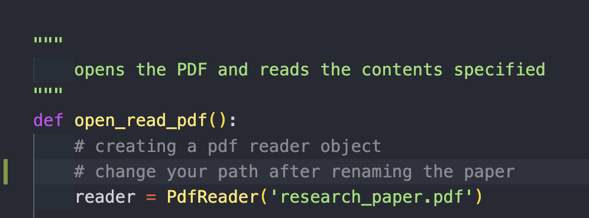
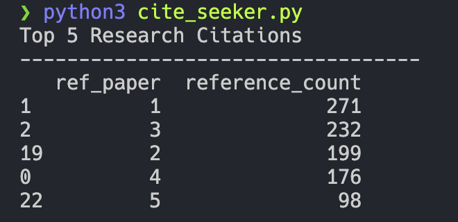

## Cite Seeker

Reads a supplied research paper and parses the document for the most cited research papers within the document. it's great for parsing a PDF, and getting ideas for any 
research discussions.

## Getting Started

* clone this repo

```shell
# create a virtual environment
python3 -m venv .venv

# windows gitbash
source .venv/Scripts/Activate

# macos
source .venv/bin/activate

# confirm python source
which python3

```

### Add research paper

add the `research_paper.pdf` or the name of the paper in your working directory of the project.



## Running

after swapping for your `research_paper.pdf` to whatever you decide. run the program

```shell
python3 cite_seeker.py
```

**Expected Output**


